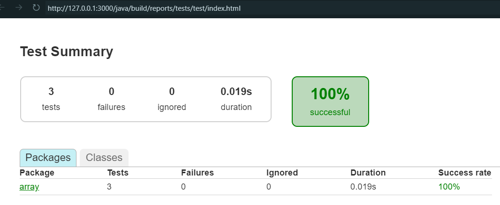

# Leetcode

## Dev Environment with Nix Home Manager and Devbox

This project uses [Devbox](https://www.jetpack.io/devbox/) and [Nix](https://nixos.org/) for a reproducible development environment.

### How Devbox is Installed

Devbox is installed system-wide or per-user using [Nix Home Manager](https://nix-community.github.io/home-manager/).  
In your `home.nix` configuration, you include Devbox like this:

```nix
home.packages = [
  pkgs.gh
  pkgs.devbox
];
```

This ensures Devbox is always available in your shell environment.

### Usage

1. **direnv Integration:**  
   If you also have `direnv` enabled (recommended), your environment will be automatically set up when you `cd` into the project directory.

2. **Manual Activation:**  
   If not using direnv, run `devbox shell` in the project directory to activate the environment.

3. **Develop as Usual:**  
   All required tools (Java, Gradle, etc.) specified in `devbox.json` will be available.

### Benefits

- **Reproducible:** Everyone gets the same environment, thanks to Nix.
- **Isolated:** No need to install project dependencies globally.
- **Declarative:** All dependencies are listed in `devbox.json` for easy updates and onboarding.

For more, see the [Devbox documentation](https://www.jetpack.io/devbox/docs/) and [Nix documentation](https://nixos.org/learn.html).

## Gradle

```shell
gradle build
gradle test --continuous
```

[Test Summary](http://127.0.0.1:3000/java/build/reports/tests/test/index.html)
