# TwoSum.java – LeetCode Problem Explanation

The `TwoSum` class solves the classic LeetCode "Two Sum" problem:  
Given an array of integers `nums` and an integer `target`, find the indices of the two numbers such that they add up to `target`.

## Approaches

### 1. Brute Force

- **Idea:**  
  Check every possible pair of numbers in the array to see if they sum to the target.

- **Implementation:**  
  Use two nested loops: for each element, check every other element after it.

- **Time Complexity:**  
  - **O(n²)**, where n is the length of the array.  
    (You check every pair once.)

- **Space Complexity:**  
  - **O(1)**, since no extra space is used beyond a few variables.

### 2. HashMap (Efficient Approach)

- **Idea:**  
  Use a hash map to store each number and its index as you iterate through the array.  
  For each number, check if `target - number` exists in the map.

- **Implementation:**  
  - Iterate through the array once.
  - For each element, calculate its complement (`target - nums[i]`).
  - If the complement is in the map, return the indices.
  - Otherwise, add the current number and its index to the map.

- **Time Complexity:**  
  - **O(n)**, since each lookup and insertion in the hash map is O(1) on average.

- **Space Complexity:**  
  - **O(n)**, for storing up to n elements in the hash map.

### Summary Table

| Approach     | Time Complexity | Space Complexity |
|--------------|----------------|-----------------|
| Brute Force  | O(n²)          | O(1)            |
| HashMap      | O(n)           | O(n)            |

The `TwoSum.java` implementation uses the efficient HashMap approach for optimal performance.

```mermaid
flowchart TD
    A["Start: nums = '2, 7, 11, 15'; target = 9"] --> B["Initialize empty HashMap"]
    B --> C["Step 1: i = 0, num = 2"]
    C --> D["Compute complement: 9 - 2 = 7"]
    D --> E{"Is 7 in HashMap?"}
    E -- "No" --> F["Store (2 → 0) in HashMap"]
    F --> G["Step 2: i = 1, num = 7"]
    G --> H["Compute complement: 9 - 7 = 2"]
    H --> I{"Is 2 in HashMap?"}
    I -- "Yes" --> J["Return indices (0, 1)"]
    J --> K["End"]
```

